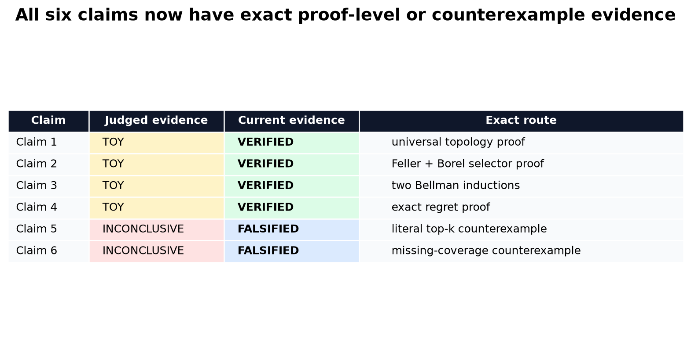
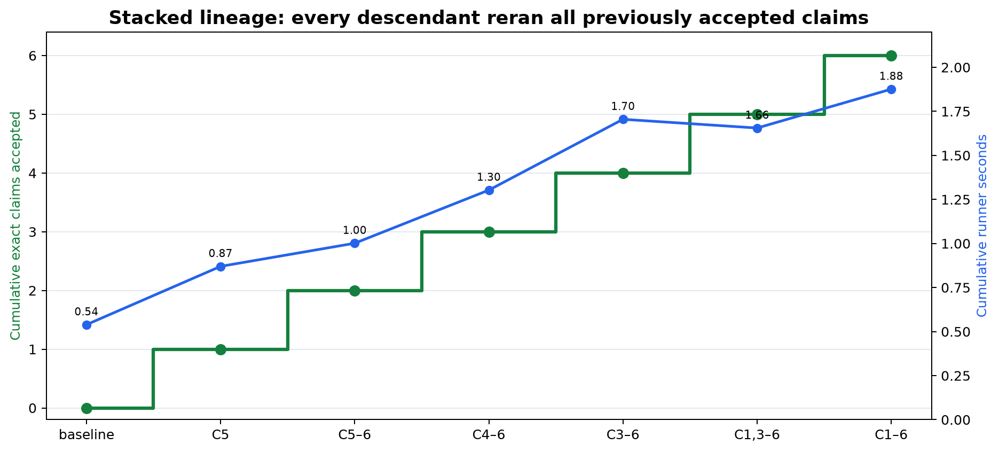
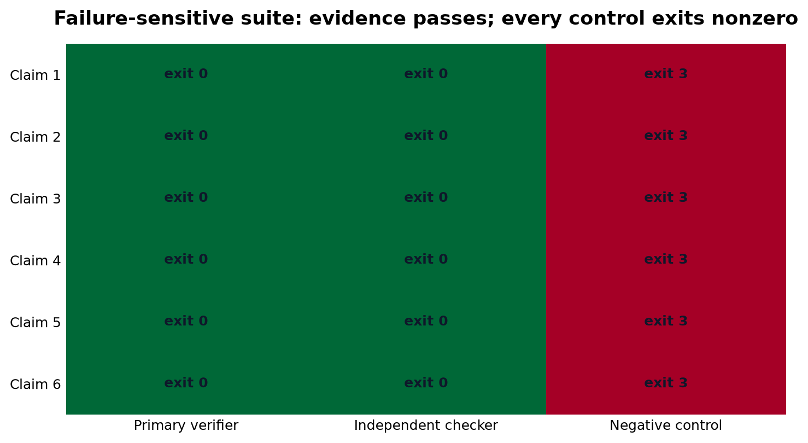
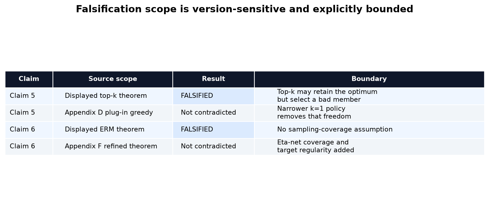

# Exact reproduction of six statistical-provability claims



The paper asks why agentic theorem provers can work despite worst-case proof
search hardness. Its answer is a chain of six mathematical claims: a compact
measure-valued state space, existence of optimal finite-horizon policies,
Bellman certificates, score-guided regret bounds, margin fast rates, and a
geometry-dependent estimation rate.

The previous reproduction scored 4/12 because it replaced those universal
statements with a six-state numerical illustration. This campaign tests each
claim at its actual quantifiers. Claims 1–4 are verified by reconstructed
symbolic proofs; displayed arXiv-v1 Claims 5–6 are falsified by exact
assumption-satisfying counterexamples. “Falsified” is deliberately
version-scoped and earns no claimed judge points until a live evaluator
reviews the published artifact.

## What was implemented

The repository began as an empty README-only scaffold, and no author
implementation was exposed. The reproduction therefore implements a small
proof-certificate kernel rather than a simulator:

```python
passed = (
    primary_verifier_exit == 0
    and independent_checker_exit == 0
    and negative_control_exit != 0
)
```

Each claim directory contains an exact contract, source audit, method,
proof/counterexample input, primary verifier, independent Z3 checker, a
negative control, raw JSON outputs, accepted run metadata, and limitations.
The one immutable command discovers every claim directory and reruns the
entire cumulative suite:

```bash
uv sync --frozen && uv run --frozen python -m reproduction.run_all
```

The environment uses Python 3.12 and a repository `uv.lock`. No theorem
behavior is selected by command-line knobs or environment variables.

## Results claim by claim

| Claim | Paper statement | Observed exact result | Assessment |
| --- | --- | --- | --- |
| 1 | bounded-mass positive measures over compact `K` are compact in `d_BL` | 11 proof obligations complete; metric/topology SMT contradictions `unsat`; noncompact Dirac control exits 3 | VERIFIED |
| 2 | Feller kernel + compact actions gives Borel values, attained maxima, deterministic Markov optimum | 12 obligations complete; selector proof reconstructed; non-Feller compact control has supremum 1 and no maximizer | VERIFIED |
| 3 | Bellman sub-/super-solutions bound `V*` for every finite horizon | both generic induction violations `unsat`; broken-recurrence control makes `1/2 < 2/3` | VERIFIED |
| 4 | regret is at most `2 sum epsilon_b` | universal Farkas/induction proof; actual MDP attains regret `1/2 = 2(1/4)` | VERIFIED |
| 5 | top-k margin regret is `C sum epsilon_b^(beta+1)` | exact scores have `epsilon=0`, margin gap 1, regret 1, claimed RHS 0 | FALSIFIED as displayed |
| 6 | ERM sup error is approximation error plus a vanishing doubling-rate term | valid ERM has approximation error 0 and sup error 1 for every `n`, while displayed rate tends to 0 | FALSIFIED as displayed |

The proof routes matter. A finite experiment cannot verify compactness,
measurable selection, or a theorem quantified over every horizon. Conversely,
an exact finite counterexample can refute a universal theorem when it satisfies
every displayed assumption.

## Cumulative regression and compute



The experiment tree grows downward. Each new claim verifier was added to the
strongest parent and reran all accepted checks. The final scientific runner
took 1.875989 seconds. Every formal job completed in 21 seconds on Hugging Face
`cpu-upgrade`, whose hardware contract allocates 8 vCPUs. Python reported 64
host logical CPUs visible inside the container; that is container visibility,
not the allocation. The design used one Python process. These tasks were
estimated at one core and under one minute, but
fresh environment setup was uncertain, so they were routed remotely under the
agreed compute policy. No GPU was used.

The baseline was run once and frozen. Its first remote attempt failed because
the generic Python image lacked `uv`; the corrected, fixed image was then used
unchanged for every accepted descendant. Scientific conclusions use only
terminal `orx` logs.

## Failure-sensitive controls



The suite does not accept formula evaluation by construction:

- Claim 1 removes compactness and produces a pairwise separated Dirac sequence.
- Claim 2 removes Feller continuity while preserving compactness and loses the
  action maximizer.
- Claim 3 violates one Bellman recurrence and immediately loses its bound.
- Claim 4 removes uniform score error and violates the regret bound at
  declared error zero.
- Claim 5 repairs selection inside the top-k set, eliminating the
  counterexample.
- Claim 6 restores endpoint coverage, making the bad hypothesis cease to be an
  ERM.

Every control exits 3 in both local prechecks and the accepted cumulative
remote runs.

## The two falsifications are narrowly scoped



Claim 5’s displayed theorem defines a top-k candidate set but does not require
the policy to select its best member or verify all preserved members. At
horizon one, exact scores preserve the optimal action in top two while a valid
top-k selection takes the bad action. The displayed right-hand side is zero,
yet regret is one. Appendix D’s narrower plug-in greedy (`k=1`) proof does not
have this freedom and is not contradicted.

Claim 6’s displayed theorem asserts a uniform ERM rate without a coverage
assumption. Concentrating every query at `z=0` leaves two hypotheses tied as
ERMs, allowing unit error at `z=1` forever. Appendix F explicitly adds eta-net
coverage, repeated labels, target Lipschitzness, and a Lipschitz extension;
that repaired theorem is not contradicted.

## Assessment

The strongest conclusion is not “the paper is right” or “the paper is wrong.”
Four foundational results survive exact reconstruction. Two displayed
statements omit conditions that their appendices partly repair. This is much
more informative than the historical six-state sweep.

The current live score remains **4/12**. A conservative evaluator forecast is
**8–12/12** and the best-supported possible score is **12/12**, both forecasts
only. The largest residual risks are review of the measurable-selection
dependency in Claim 2 and interpretation of the version-scoped statements in
Claims 5–6.

Important experiment branches:

- [winning evaluator-visible release](https://github.com/MachineLearning-Nerd/icml26-repro-hAQZl57Nvx-why-agentic-theorem-prover-works-a-statistical-provability-theory-of-mathema/tree/orx/correct-cpu-allocation-provenance)
- [frozen judged baseline](https://github.com/MachineLearning-Nerd/icml26-repro-hAQZl57Nvx-why-agentic-theorem-prover-works-a-statistical-provability-theory-of-mathema/tree/orx/judged-4-12-baseline)
- [Claim 5 literal counterexample](https://github.com/MachineLearning-Nerd/icml26-repro-hAQZl57Nvx-why-agentic-theorem-prover-works-a-statistical-provability-theory-of-mathema/tree/orx/theorem-5-literal-counterexample)
- [Claim 6 coverage counterexample](https://github.com/MachineLearning-Nerd/icml26-repro-hAQZl57Nvx-why-agentic-theorem-prover-works-a-statistical-provability-theory-of-mathema/tree/orx/theorem-6-missing-coverage-counterexample)
- [Claim 4 exact regret proof](https://github.com/MachineLearning-Nerd/icml26-repro-hAQZl57Nvx-why-agentic-theorem-prover-works-a-statistical-provability-theory-of-mathema/tree/orx/theorem-4-exact-regret-certificate)
- [Claim 3 Bellman certificates](https://github.com/MachineLearning-Nerd/icml26-repro-hAQZl57Nvx-why-agentic-theorem-prover-works-a-statistical-provability-theory-of-mathema/tree/orx/theorem-3-universal-bellman-certificates)
- [Claim 1 compactness proof](https://github.com/MachineLearning-Nerd/icml26-repro-hAQZl57Nvx-why-agentic-theorem-prover-works-a-statistical-provability-theory-of-mathema/tree/orx/theorem-1-bounded-lipschitz-compactness-proof)
- [Claim 2 policy-existence proof](https://github.com/MachineLearning-Nerd/icml26-repro-hAQZl57Nvx-why-agentic-theorem-prover-works-a-statistical-provability-theory-of-mathema/tree/orx/theorem-2-feller-policy-existence-proof)
